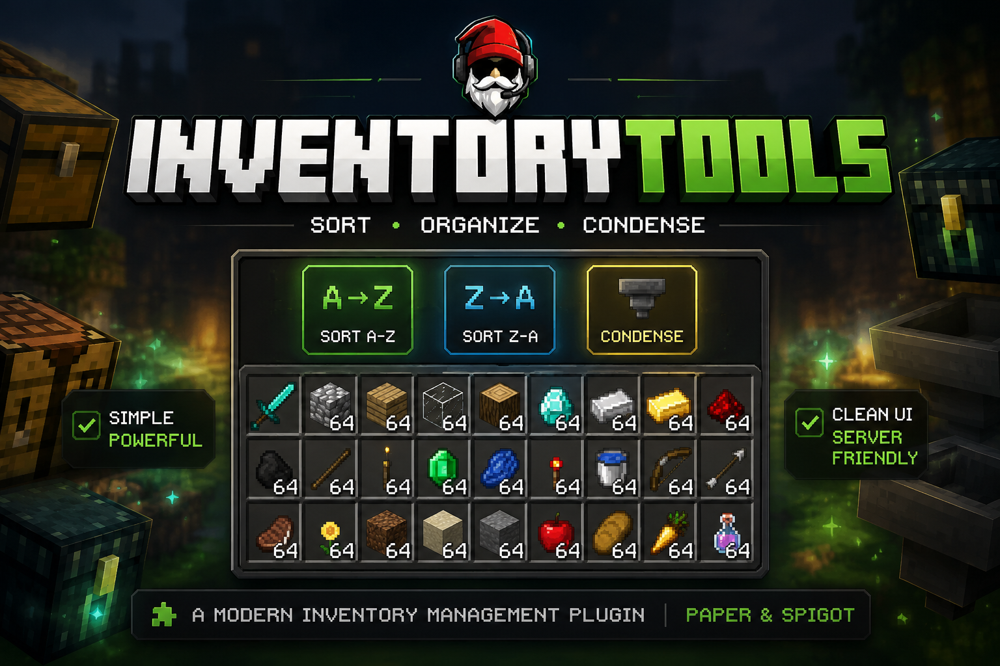

  

# InventoryTools

InventoryTools is a Minecraft Java Edition plugin for Paper and Spigot servers that adds fast inventory organization utilities directly into the player inventory.

---

## Features

- Sort inventory A → Z
- Sort inventory Z → A
- Condense items into full stacks
- Clean inventory management UI
- Lightweight and server friendly
- Permission support
- Configurable button positions

---

## Planned Features

- Double chest sorting
- Auto-sort options
- Favorite item protection
- Shift-click sorting
- Sound and particle effects
- Player preferences
- Additional sorting modes

---

## Buttons

| Button | Function |
|---|---|
| A → Z | Sort items alphabetically ascending |
| Z → A | Sort items alphabetically descending |
| Condense | Combine items into full stacks |

---

## Commands

| Command | Description |
|---|---|
| `/inventorytools enable` | Enable InventoryTools |
| `/inventorytools disable` | Disable InventoryTools |
| `/inventorytools reload` | Reload plugin configuration |

---

## Permissions

| Permission | Description |
|---|---|
| `inventorytools.use` | Base permission |
| `inventorytools.sort.asc` | Allows ascending sort |
| `inventorytools.sort.desc` | Allows descending sort |
| `inventorytools.condense` | Allows stack condensing |

---

## Compatibility

| Platform | Versions |
|---|---|
| Minecraft Java Edition | 1.17+ |
| Server Software | Paper / Spigot |

---

## Installation

1. Download the latest release.
2. Place the `.jar` file into your server `plugins` folder.
3. Restart the server.
4. Configure permissions if needed.

---

## Documentation

- [Installation Guide](docs/installation.md)
- [Permissions](docs/permissions.md)
- [Configuration](docs/configuration.md)
- [Roadmap](ROADMAP.md)

---

## Community

- Website: https://warthawggaming.com
- GitHub: https://github.com/WarthawgGaming
- Discord: https://discord.gg/SFKsPd8YjH

---

## License

This project is licensed under the MIT License.
